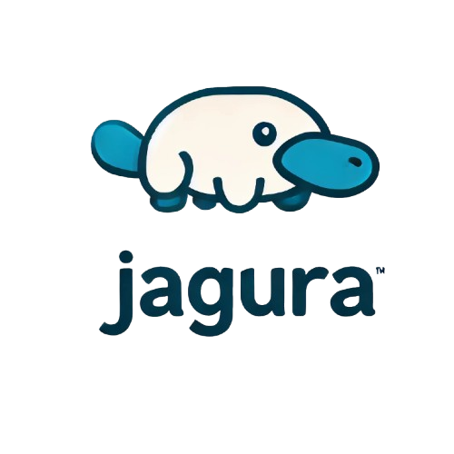

<p align="center">
  
</p>


> **An SQL interface for managing containers.**  
> Jagura works like any SQL database, but with an additional `CONTAINER` data type that provides special functions to manage container operations such as **start**, **stop**, **kill**, **restart**, **pause**, **unpause**, **get container metadata**, **run commands in the container**, and more.

---

## Table of Contents

- [Overview](#overview)  
- [Requirements](#requirements)  
- [Installation](#installation)  
- [Usage](#usage)  
  - [SQL Syntax](#sql-syntax)  
  - [Container Functions](#container-functions)  
  - [Examples](#examples)  
- [Contributing](#contributing)  
- [License](#license)

---

## Overview

Jagura is designed to feel familiar to anyone using SQL. Create tables, insert rows, query with standard SQL syntax, and leverage container-specific functions:

- **Standard SQL**  
  - `CREATE TABLE`, `INSERT`, `SELECT`, `WHERE`, etc.
  - Aggregations like `SUM()`, `COUNT()`, `LENGTH()` on numeric or string columns.
- **Container-Aware SQL**  
  - `START(container_column)`, `STOP(container_column)`, `RESTART(container_column)`, etc.
  - Get container `METADATA`.
  - Run commands inside containers with `RUN_CMD()`.

---

## Requirements

To run Jagura, you will need:

1. **[Jagura (this project)](https://github.com/doruyaar/Jagura)**
2. **[Jagura-UI (other project)]([https://github.com/doruyaar/Jagura-UI](https://github.com/doruyaar/Jagura-UI))**
3. **[Docker Desktop](https://www.docker.com/products/docker-desktop)**, running in the background.
4. **Docker images** you want to use (e.g., `alpine`, `nginx`, etc.).

---

## Installation

```bash
# 1. Clone the Paddock repo and install dependencies:
git clone https://github.com/doruyaar/paddock.git
cd paddock
npm install

# 2. Clone the Paddock-Frontend repo in a separate folder and install dependencies:
git clone https://github.com/doruyaar/paddock-frontend.git
cd paddock-frontend
npm install
```

> **Ensure Docker Desktop** is installed and running.

---

## Usage

### Starting the Server and Frontend

```bash
# Run the server in the Paddock project
npm start run:api

# Run the frontend in the Paddock-Frontend project
npm run dev
```

- The frontend will typically run on [http://localhost:5173/](http://localhost:5173/).  
- **Docker Desktop** should be open and running in the background.
- Pull the desired Docker images on your system, for example:
  ```bash
  docker pull alpine
  docker pull nginx
  # ...and so on
  ```

---

### SQL Syntax

Jagura supports standard SQL commands with a twist:

```sql
-- Create a table
CREATE TABLE tablename (id NUMBER, name STRING, app CONTAINER);

-- DELETE a table
DROP TABLE tablename;

-- Insert records
INSERT INTO tablename (2, 'aaaa', 'imgs/alpine.json');
INSERT INTO tablename (3, 'bbbbb', 'imgs/nginx.json');

-- Query data
SELECT * FROM tablename;

-- Built-in SQL functions
SELECT SUM(id) FROM tablename;
SELECT COUNT(*) FROM tablename;
SELECT LENGTH(name) FROM tablename;
```

> **Note**: The app currently works with a path to a JSON file (e.g., `imgs/alpine.json`) that defines the image.  
> Ensure you have the corresponding Docker image pulled locally.

---

### Container Functions

These specialized functions operate on any `CONTAINER` type column:

```sql
-- Start container
SELECT START(app) FROM tablename;
SELECT START(app) FROM tablename WHERE id = 2;

-- Stop container
SELECT STOP(app) FROM tablename WHERE id = 2;

-- Kill container
SELECT KILL(app) FROM tablename;

-- Restart container
SELECT RESTART(app) FROM tablename;

-- Pause/Resume container
SELECT PAUSE(app) FROM tablename;
SELECT UNPAUSE(app) FROM tablename;

-- Metadata
SELECT METADATA(app) FROM tablename;

-- Extract a single key from Metadata
SELECT METADATA(app, status) FROM tablename;

-- Run Commands in Container
SELECT RUN_CMD(app, 'ls -la') FROM tablename WHERE id = 4;
```

The `METADATA(app)` call returns JSON metadata, for example:

```json
{
  "name": "/my-alpine-container",
  "image": "alpine",
  "status": "running",
  "port": "N/A",
  "hostPort": "N/A",
  "cpuUsage": 18722000,
  "lastStarted": "2024-12-31T18:39:39.492046291Z"
}
```

---

### Examples

#### Creating an Alpine container, installing `curl`, and making an API request:

```sql
-- Create a table
CREATE TABLE t1 (id NUMBER, c CONTAINER);

-- Insert a record with Alpine
INSERT INTO t1 (3, 'imgs/alpine.json');

-- Start the Alpine container
SELECT START(c) FROM t1 WHERE id = 3;

-- Install curl on Alpine
SELECT RUN_CMD(c, "apk add --no-cache curl") FROM t1 WHERE id = 3;

-- Perform an API request from within the container (Dragon Ball API example)
SELECT RUN_CMD(c, "curl -s https://dragonball-api.com/api/characters/2") FROM t1 WHERE id = 3;

-- Extract the "name" key from the JSON response
SELECT RUN_CMD(c, "curl -s https://dragonball-api.com/api/characters/2", name) FROM t1 WHERE id = 3;

-- Return additional info like id and container metadata in the same query
SELECT RUN_CMD(c, "curl -s https://dragonball-api.com/api/characters/2", name), id, METADATA(c) FROM t1 WHERE id = 3;
```

**Note**: In the frontend, you can highlight the row of SQL you want to execute and press **Run** (or CTRL + ENTER) —it will execute only that highlighted row, just like in many SQL editors.  
Happy container-managing with **Jagura**!
